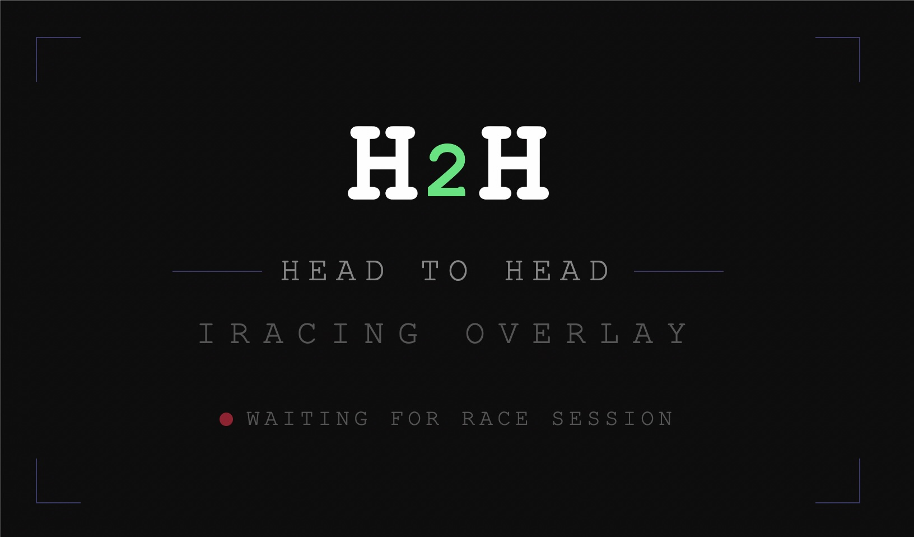
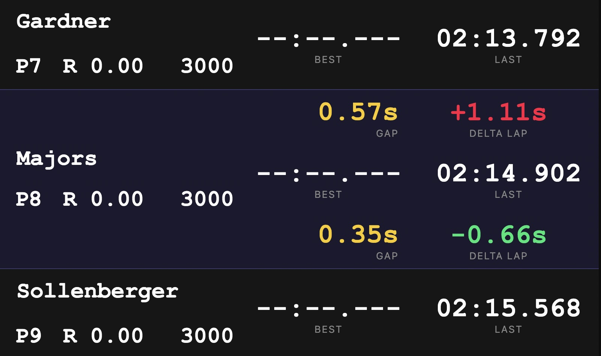
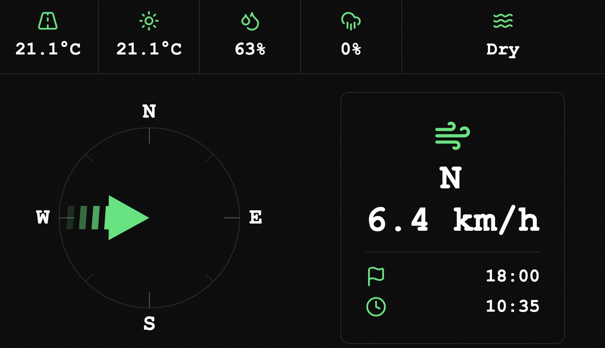
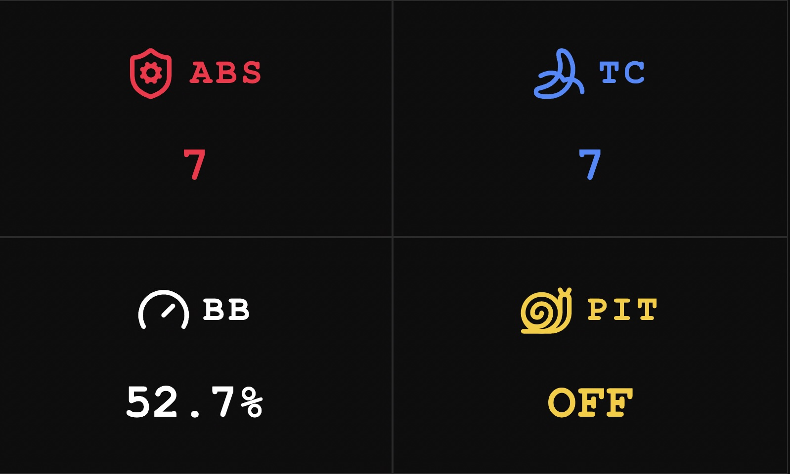

# h2h-iracing

A collection of dashboards / overlays for iRacing, built with Node.js and TypeScript. 
Ready to be used within SimHub or OBS for live streaming.

- Real-time head-to-head battle overlay for iRacing: Tracks your position relative to the cars immediately ahead and behind you, showing gaps, deltas, and driver info.
- Weather overlay: Displays current track weather conditions and wind direction/speed relative to the car direction.
- Car telemetry overlay: Shows key car telemetry data (ABS, TC, brake bias, pit limiter)

## Download & Installation

1. Go to [Release page](https://github.com/emilioSp/h2h-iracing/releases), download the latest version of H2H and unzip it.
2. Run the executable file (h2h-iracing.exe) to start the server. You should see a welcome page with instructions and a link to the dashboard.
3. SimHub dashboards are included in the release, but you can also find them in the `simhub_dashies` folder. Import them into SimHub.

## Screenshots









## Youtube video demonstration

[](https://www.youtube.com/watch?v=PTLM69iB8SU)

## Prerequisites

- Node.js 24+ (for development)
- iRacing running on Windows (for live mode)
- [SimHub](https://www.simhubdash.com/) or an OBS browser for live streaming (e.g [OBS](https://obsproject.com/kb/browser-source))

## Local Development

Two modes of operation:

- **Server + UI** — HTTP server with SSE + React overlays
- **CLI** — terminal UI for local monitoring (manly for development/testing)

Create a `.env` file with the following variables:

| Variable                   | Description                                            | Required |
|----------------------------|--------------------------------------------------------| -------- |
| `DATA_MODE`                | `live` (iRacing SDK) or `mock` (dump file)             | yes      |
| `DUMP_FILE_PATH`           | Path to `.bin` dump file (mock mode only)              | yes      |
| `POLL_INTERVAL_MS`         | Telemetry polling interval in milliseconds             | yes      |
| `PORT`                     | HTTP server port                                       | yes      |
| `LOG_LEVEL`                | `debug` / `info`                                       | yes      |

Start in mock mode (no iRacing required):

```bash
# Server + UI overlay
npm run server:start:dev

# Terminal UI
npm run cli:start:dev
```

Start in live mode (iRacing must be running):

```bash
# Server + UI overlay
npm run h2h:start

# Terminal UI
npm run cli:start
```

## Folder Structure

```
src/
└── server/
    ├── ticker        # Main loop: polls iRacing SDK, refreshes data
    ├── broadcaster   # SSE broadcaster for pushing updates to clients
    ├── router/       # Handles incoming client requests and SSE endpoints
    ├── dashboard/    # Entry points and orchestration for dashboards
    ├── service/      # Business logic (gap/delta calculations, lap times, standings...)
    └── repository/   # Data layer — iRacing SDK integration and in memory data storage
```

- **router** — entry point for HTTP/SSE requests; delegates work to services
- **service** — pure business logic, no I/O concerns
- **repository** — wraps external resources (iRacing SDK, file system)

## API

All endpoints use Server-Sent Events (SSE) and push updates at every poll interval.

### `GET /sse/h2h`

Head-to-head state relative to the cars immediately ahead and behind.

```json
{
  "data": {
    "sessionTime": 1234.5,
    "player": {
      "position": 3,
      "driver": { "carIdx": 7, "name": "...", "carNumber": "07", "car": "...", "iRating": 3000, "license": "A 4.99", "classEstLapTime": 84.1 },
      "lastLapTime": 85.123,
      "bestLapTime": 84.567,
      "lap": 12
    },
    "ahead": { "..." },
    "behind": { "..." },
    "gapAhead": { "value": 1.234, "unit": "seconds" },
    "gapBehind": { "value": 2.567, "unit": "seconds" },
    "deltaAhead": -0.456,
    "deltaBehind": 0.789
  }
}
```

`ahead` and `behind` are `null` when there is no car in that position. `gapAhead` and `gapBehind` are `null` accordingly. The `unit` field can be `"seconds"` or `"laps"`.

### `GET /sse/weather`

Current track weather conditions.

```json
{
  "data": {
    "airTemperatureC": 24.5,
    "trackTemperatureC": 31.2,
    "relativeHumidityPct": 58.0,
    "precipitationPct": 0.0,
    "trackWetness": "Dry",
    "windDirectionRad": 1.57,
    "windDirectionDeg": 90.0,
    "windRelativeDirectionRad": 0.42,
    "windRelativeDirectionDeg": 24.0,
    "windVelocityMs": 3.5,
    "yawNorthDirectionRad": 1.15,
    "yawNorthDirectionDeg": 65.9,
    "sessionSecondsAfterMidnight": 43200
  }
}
```

### `GET /sse/car`

Key car telemetry data.

```json
{
  "data": {
    "abs": 4,
    "tc": 3,
    "isAbsActive": false,
    "isTcActive": false,
    "brakeBias": 54.2,
    "isPitSpeedLimiterActive": false
  }
}
```

## Testing

```bash
npm test
```

## Documentation

- [How the gap is calculated](docs/gap-calculation.md)
