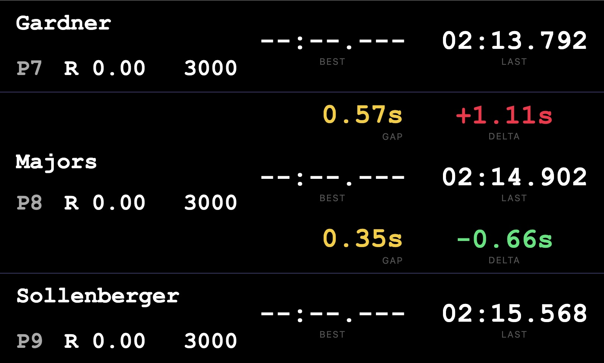

# h2h-iracing

Real-time head-to-head battle overlay for iRacing. Tracks your position relative to the cars immediately ahead and behind you, showing gaps, deltas, and driver info.

Two modes of operation:

- **Server + UI** — HTTP server with SSE + React overlay for streaming software (OBS)
- **CLI** — terminal UI for local monitoring (manly for development/testing)

## Screenshots




## Prerequisites

- Node.js 24+
- iRacing running on Windows (for live mode)

## Local Development

Create a `.env` file with the following variables:

| Variable           | Description                                | Required |
| ------------------ | ------------------------------------------ | -------- |
| `DATA_MODE`        | `live` (iRacing SDK) or `mock` (dump file) | yes      |
| `DUMP_FILE_PATH`   | Path to `.bin` dump file (mock mode only)  | yes      |
| `POLL_INTERVAL_MS` | Telemetry polling interval in milliseconds | yes      |
| `PORT`             | HTTP server port                           | yes      |
| `LOG_LEVEL`        | `debug` / `info`                           | yes      |

Start in mock mode (no iRacing required):

```bash
# Server + UI overlay
npm run server:start:dev

# Terminal UI
npm run cli:start:dev
```

Start in live mode (iRacing must be running):

```bash
# Server + UI overlay
npm run h2h:start

# Terminal UI
npm run cli:start
```

## API

### `GET /sse`

Server-Sent Events endpoint. Pushes the head to head state event at every poll interval.

Each SSE message contains:

```json
{
  "data": {
    "sessionTime": 1234.5,
    "player": {
      "position": 3,
      "driver": { "name": "...", "iRating": 3000, "license": "A 4.99", "carName": "..." },
      "lastLapTime": 85.123,
      "bestLapTime": 84.567,
      "lap": 12
    },
    "ahead": { "..." },
    "behind": { "..." },
    "gapAhead": { "value": 1.234, "unit": "seconds" },
    "gapBehind": { "value": 2.567, "unit": "seconds" },
    "deltaAhead": -0.456,
    "deltaBehind": 0.789
  }
}
```

`ahead` and `behind` are `null` when there is no car in that position. `gapAhead` and `gapBehind` are `null` accordingly. The `unit` field can be `"seconds"` or `"laps"`.

## Testing

```bash
npm test
```

Runs Vitest with coverage (85% minimum). 

## Documentation

- [How the gap is calculated](docs/gap-calculation.md)
