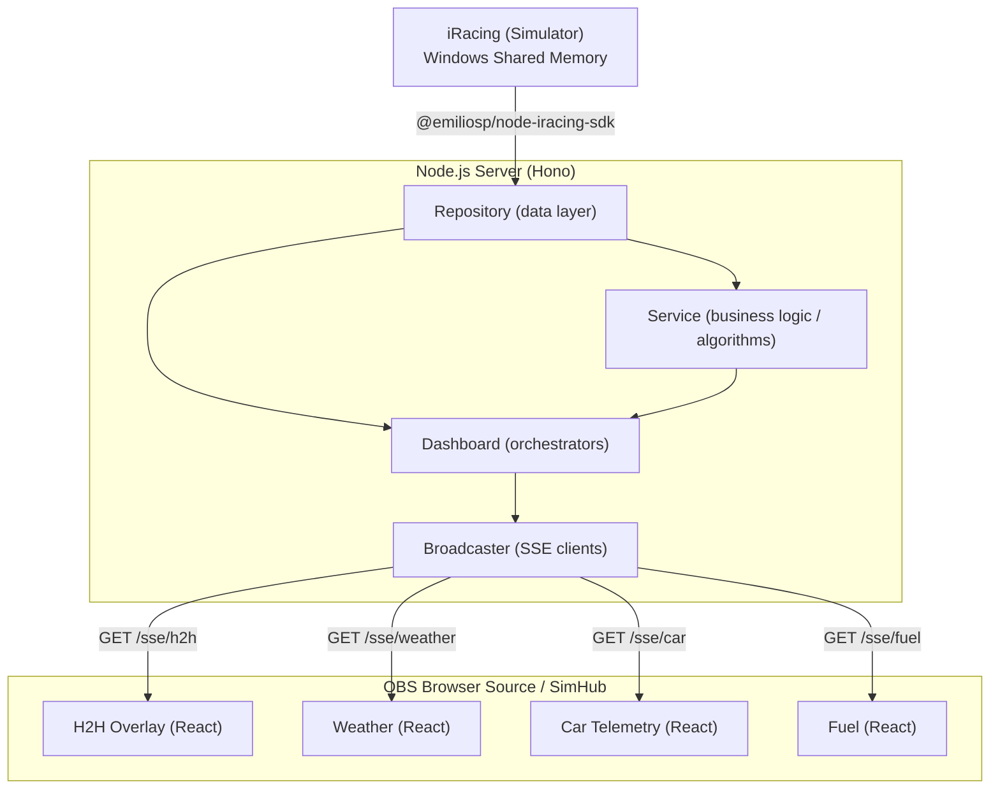

# Architecture Overview

Real-time racing overlay for iRacing. A local Node.js server reads telemetry from the iRacing simulator and pushes live updates to browser-based overlays running inside OBS or SimHub.

---

## System Diagram

---

## Layers

### Router
Thin Hono route handlers. Each route (`/sse/h2h`, `/sse/weather`, `/sse/car`, `/sse/fuel`) opens an SSE stream and registers the client with the broadcaster.

### Broadcaster
Manages the set of connected SSE clients. On each tick (~33 ms), it calls all three dashboards and writes the results to every subscribed client. The loop only runs while at least one client is connected.

### Dashboard (service orchestrator)
Aggregates repository + service output into a typed payload per overlay. One dashboard per overlay type: `head2head`, `weather`, `car-telemetry`, `fuel`.

### Service
Pure business logic. Computes standings from track position, calculates time/lap gaps between cars using a reference lap, and derives delta times.

### Repository
Wraps the iRacing SDK. Reads raw telemetry values from shared memory (speed, lap times, positions, weather, car settings). Also supports a mock mode for development without the simulator running.

---

## Data Flow

1. **Broadcaster** calls each dashboard to compute the latest payload.
2. **Payloads** are serialized as JSON and written to all connected SSE clients.
3. **React overlays** receive the event, parse the JSON, and re-render.

---
